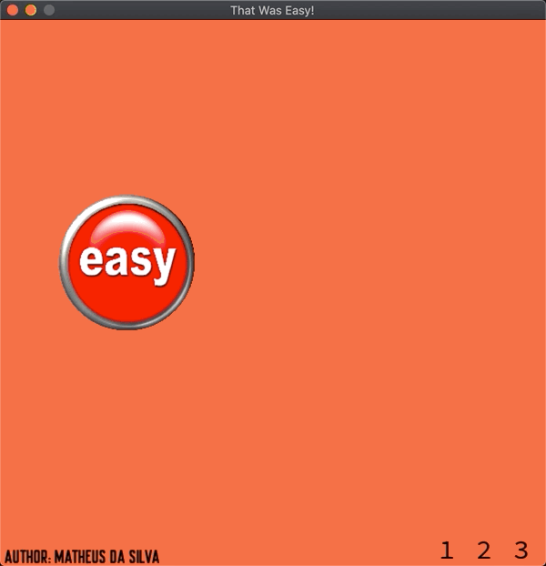

# HackAlphaX

## Days 1 & 2
##### HOW-TO
Clone the repository locally, then use Python version 2.7 to run the desired script using `python {scriptname}.py` in a terminal window.

##### Day 1 - PROJECT
A simple text based calculator that includes the ability to add, subtract, multiply, divide and exponentiate two numbers. First the program prompts the user for two values, then prompts them for a valid operation (integer values 1-5). After computing and showing the answer, the program will ask the user if they would like to perform a new calculation and the process repeats.

**BONUS**: Completed the bonus challenge which included prompting the user for a valid integer number between 1 and 1000, and deciding if it was 'Awkward' or 'Not Awkward based on the following rules:

Input | Output
------------ | -------------
Odd value | Awkward
Even and `[2,7]` | Not Awkward
Even and `[9,22]` | Awkward
Even and `]22,1000]` | Not Awkward

##### Day 2 - PROJECT
Building from the work done in Day 1, the calculator's functionalities are moved into a user-defined function and includes the following new functions: factorial, square root, and logarithm. Included a real use case of recursion in calculating factorials.

## Day 3
##### HOW-TO
Clone the repository locally, then une Python version 3.9 to run the desired script using `python3 {scriptname}.py` in a terminal window.

##### PROJECT
A simple 'That was easy' program made using Pygame where the user can click the button in the middle of the page and hear the iconic 'That was easy' sound effect.
At the bottom right of the window appears three buttons relating to the three levels of difficulty, including easy (1), medium (2), and hard (3).

**Easy**: there are no tricks and the user can freely click the 'Easy' button and hear the sound effect.

**Medium**: the 'Easy' button will try to avoid the mouse by moving away from the mouse. It is still possible to click the button and hear the sound effect.

**Hard/Impossible**: the final difficulty makes hearing the sound effect impossible by turning the cursor invisible when hovering over the 'Easy' button and disabling the ability to click on the button.

